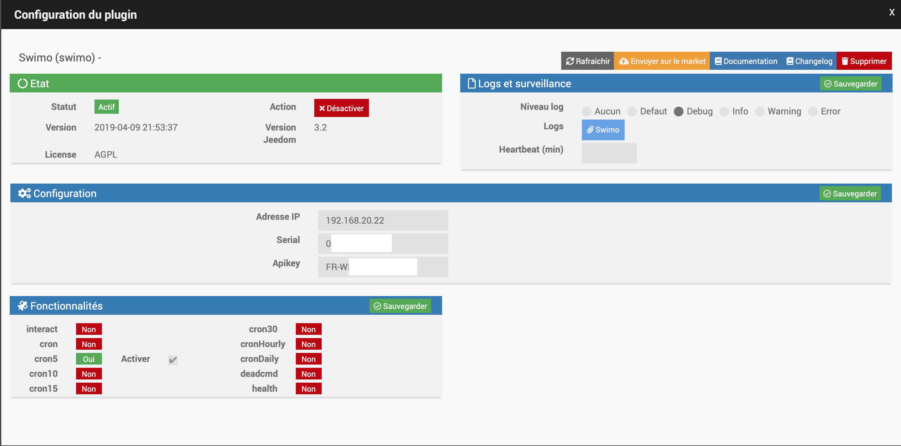
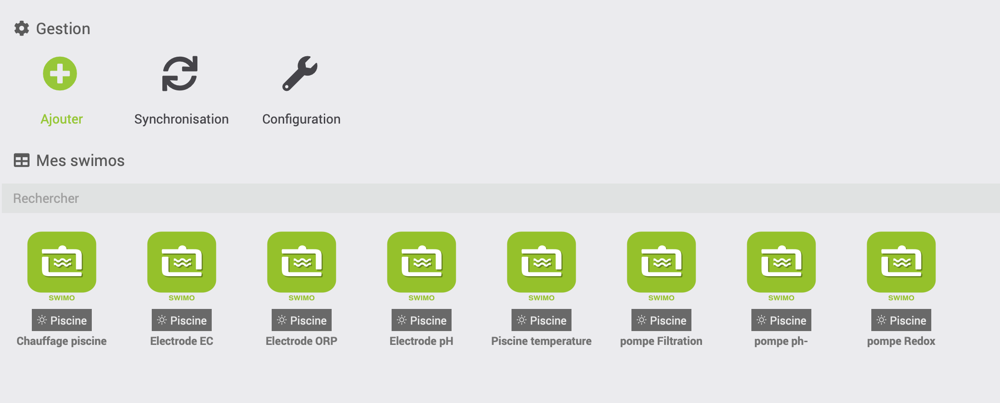

.
. 

Configuración del plugin
=======================

Después de descargar el complemento, solo necesita activarlo,
 :

- 
- 
- 

Configuración del equipo
=============================

.

 :

> **Nota**
>
> - .
> - .
> .
